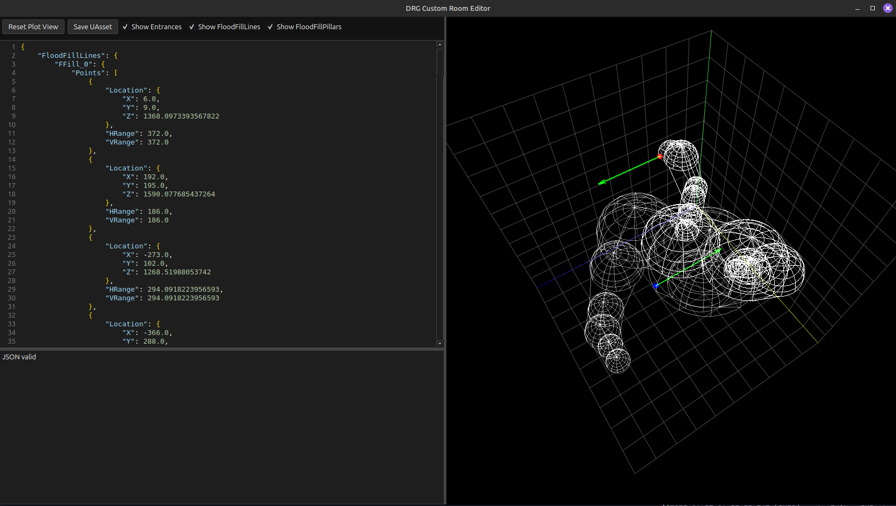

## DRG Room Editor
Inspired by https://github.com/trumank/rma-editor, this program allows the creation of new rooms or caves for the game Deep Rock Galactic. The output of the program is a uasset that needs to be packed together with a patched RMG file so the game can add the new room to the pool.

## Documentation
Please see https://vonacht.github.io/drg-room-editor-docs/.

# Third Party Licenses
The project uses UAssetAPI and its dependencies to convert from JSON to Unreal's uasset. Please find the licenses attached in THIRD_PARTY_LICENSES.md.
